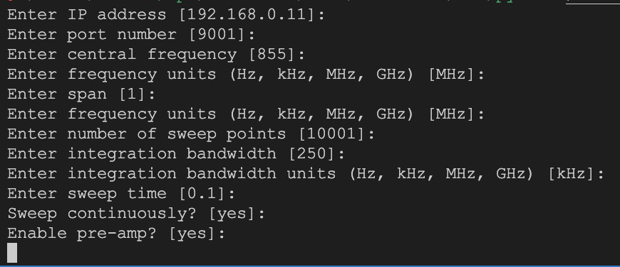

# ANRITSU MS2090A Automatic Measurement System
### Version: 0.1

## Introduction
This is a Python library for controlling the ANRITSU MS2090A Automatic Measurement System. The library is based on the [pyvisa](https://pyvisa.readthedocs.io/en/stable/) library and uses the [pyvisa-py](https://pyvisa-py.readthedocs.io/en/latest/) backend.

## Usage
The library can be used to control the MS2090A from Python. 
```python
python anritsu-ms2090a-ams
```

After execute this command, the programm will be entered in the configuration mode where you can introduce the parameters for measurements, it will be saved on a file called `"anritsu_config"`. Text between [] are the default values.



If you can create custom config files, you can use the flag -f to choose the file you want to use.

```python
python anritsu-ms2090a-ams -f config_file
```

After the configuration, the programm will be entered in the measurement mode where you can choose the type of measurement you want to do.

In continuous mode, the programm will be executed until you press Ctrl+C. When you press Ctlr+C, the programm will ask you for the name of the file where you want to save the data.