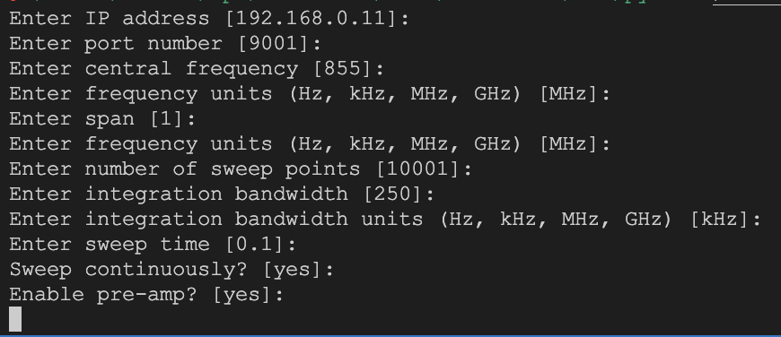

# ANRITSU MS2090A Automatic Measurement System
### Version: 1.0.0

## Introduction
This is a Python library for controlling the ANRITSU MS2090A. The library is based on the [pyvisa](https://pyvisa.readthedocs.io/en/stable/) library and uses the [pyvisa-py](https://pyvisa-py.readthedocs.io/en/latest/) backend.

## Usage

You can find the library in the `src` folder.

The library can be used to control the MS2090A from Python. 
```bash
python anritsu_ms2090a_ams
```

```python
pip install anritsu-ms2090a-ams
```

Using pip, you can run the programm from the command line with the same flags that running with Python command, but remember that when you use this method, you must be in the folder where you want to save the data and configuration files.

```bash
anritsu_ms2090a_ams
```

After execute this command, the programm will be entered in the configuration mode where you can introduce the parameters for measurements, it will be saved on a file called `"anritsu_config"`. Text between [] are the default values.



If you can create custom config files, you can use the flag `-f` to choose the file you want to use.

```bash
python anritsu_ms2090a_ams -f config_file
```

If you want skip the configuration mode, you can use the flag `--skipSetup` to skip that. To do that, you must have a config file.

```bash
python anritsu_ms2090a_ams -f config_file --skipSetup
```

After the configuration, the programm will be entered in the measurement mode where you can choose the type of measurement you want to do.

In continuous mode, the programm will be executed until you press Ctrl+C. When you press Ctlr+C, the programm will ask you for the name of the file where you want to save the data.
